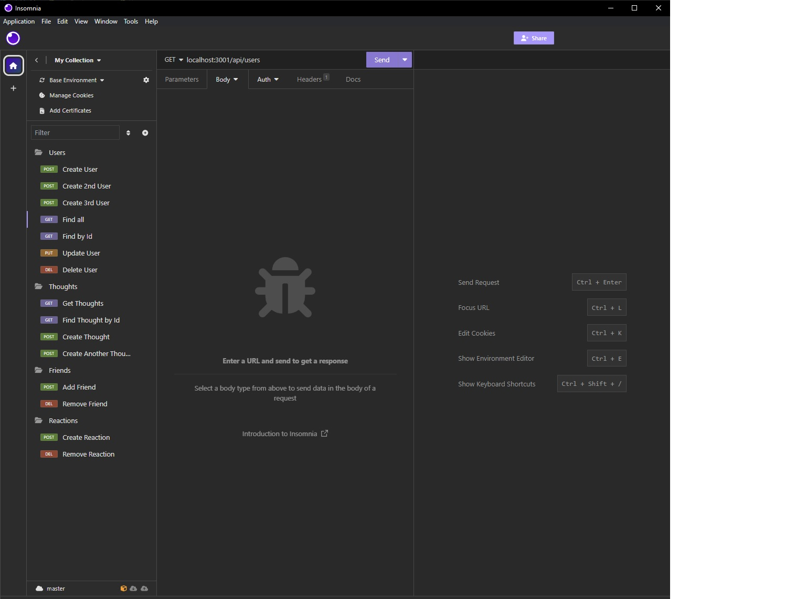

# Social Network API

## Description

This application was developed using the Express and Mongoose packages to develop a backend database for a social network application that allows users to record thoughts, reactions to other user's thoughts, as well as to add friends to their profile.

## Installation

- Clone the repository to the specified location on your computer.
- From the integrated terminal in VS Code/IDE, run `npm i` to install the required packages (Express and Mongoose).  

## Usage

Run `node server` from the root directory in the integrated terminal to initialize the database and run it on the local server.  Utilize Insomnia to manipulate the database to create/update/delete users, thoughts and reactions and add/remove friends.  If desired, the database may also be viewed and manipulated using MongoDB.

Tutorial video demonstrating the usage in Insomnia: https://drive.google.com/file/d/19KALkie53V_P-8-8mOu6JL7dqPhSIO2k/view

## Credits

This project was created utilizing a database structure guide as provided by UNC Chapel Hill Coding Bootcamp.